# 📊 Order Management System - Business Flow Diagrams
## Visual Documentation of Business Processes and Accounting Integration

---

## 🎯 **Overview**

This document provides visual representations of the business workflows and accounting integration points within the Order Management System. Each diagram shows the complete flow from business action to accounting impact.

---

## 🔄 **Complete Order Lifecycle Flow**

### **Master Business Process Flow**
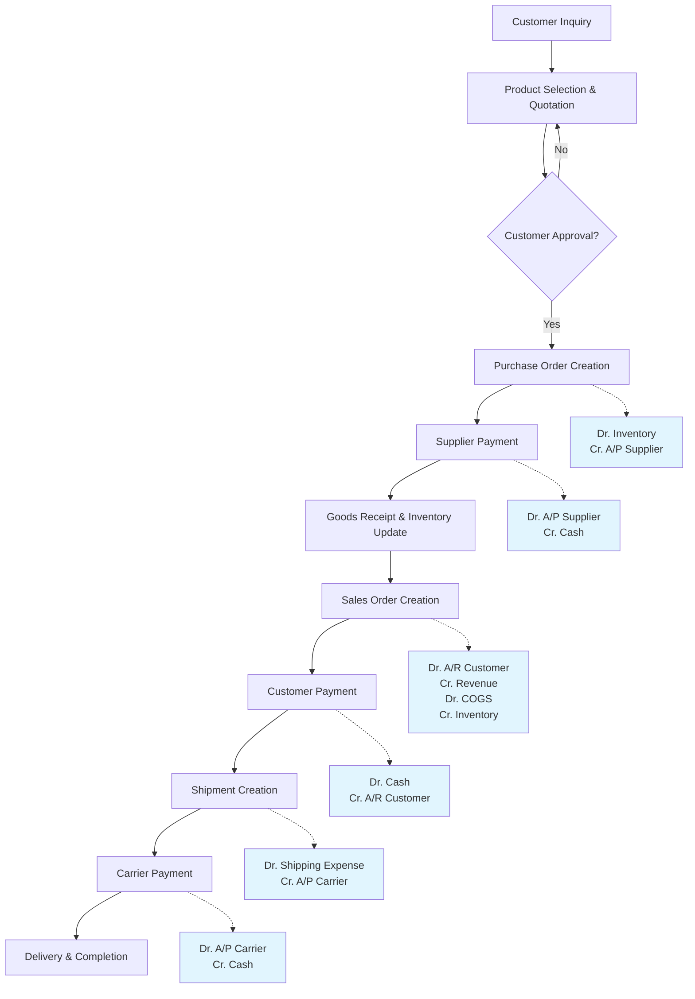

---

## 💰 **Revenue Recognition Flow**

### **Sales Order Revenue Recognition Process**
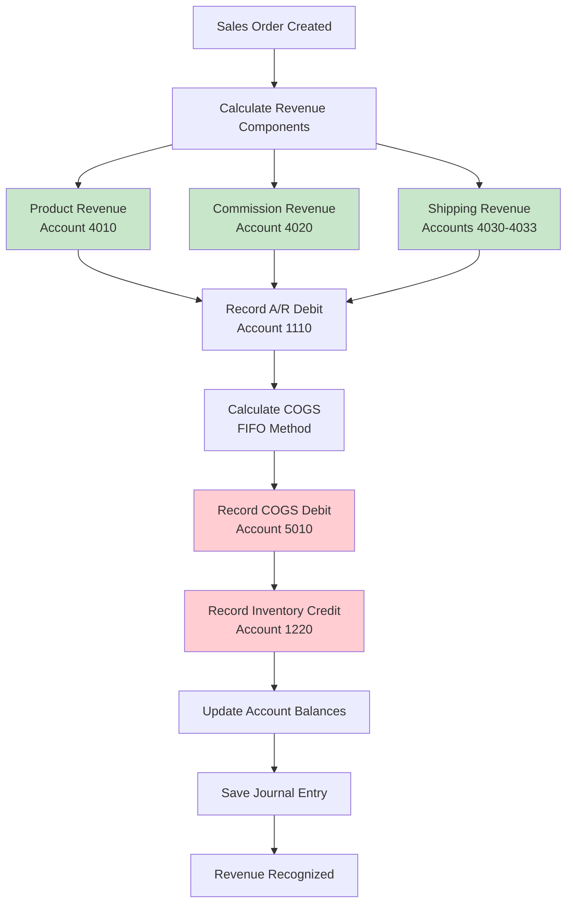

### **Revenue Breakdown by Type**
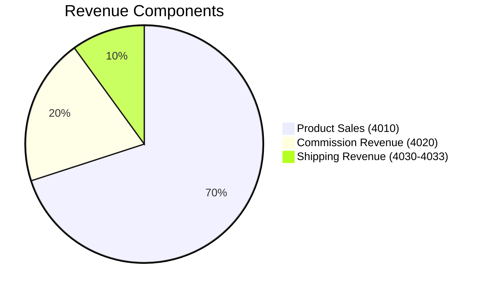

---

## 🚚 **Shipping Accounting Integration**

### **Multi-Carrier Shipping Process**
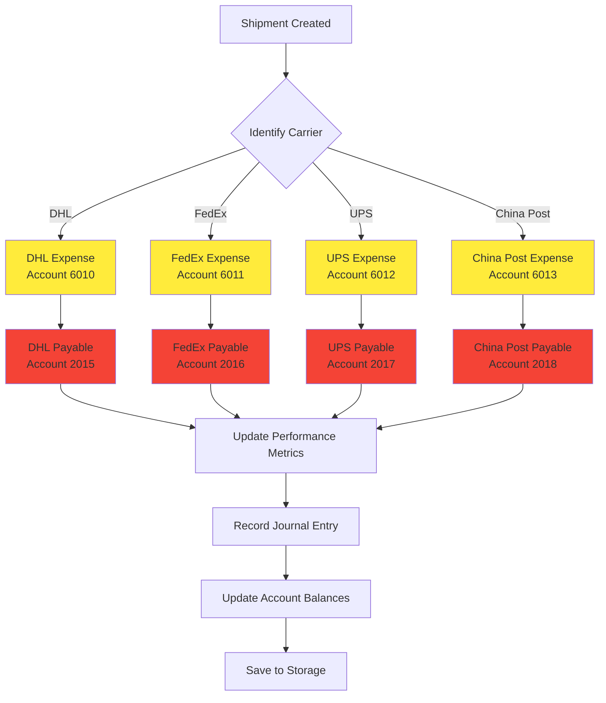

### **Shipping Profit Analysis Flow**
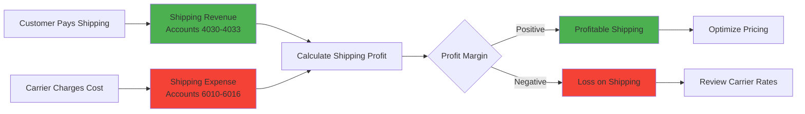

---

## 📦 **Inventory Management Flow**

### **Inventory Lifecycle with Accounting**
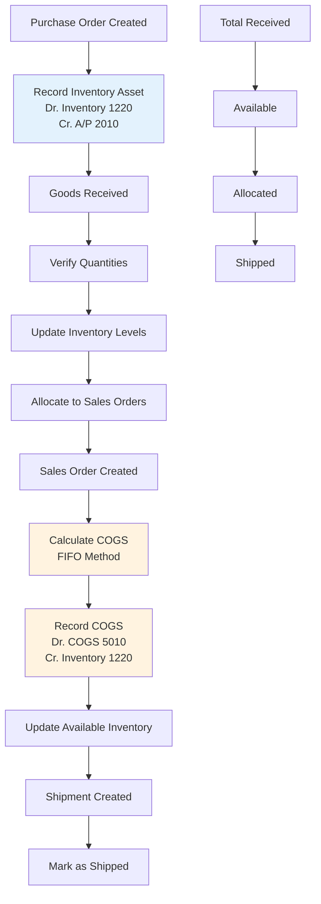

### **FIFO Costing Method**
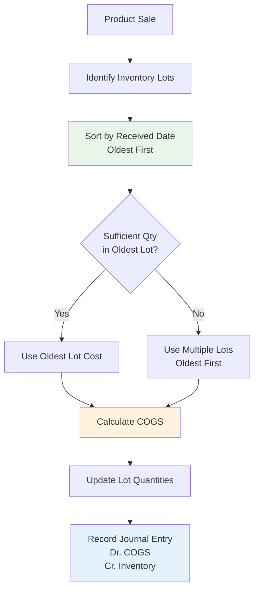

---

## 💳 **Payment Processing Flows**

### **Supplier Payment Process**
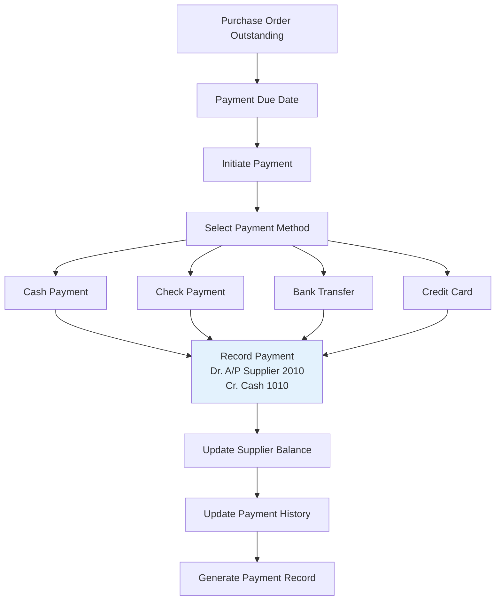

### **Customer Payment Process**
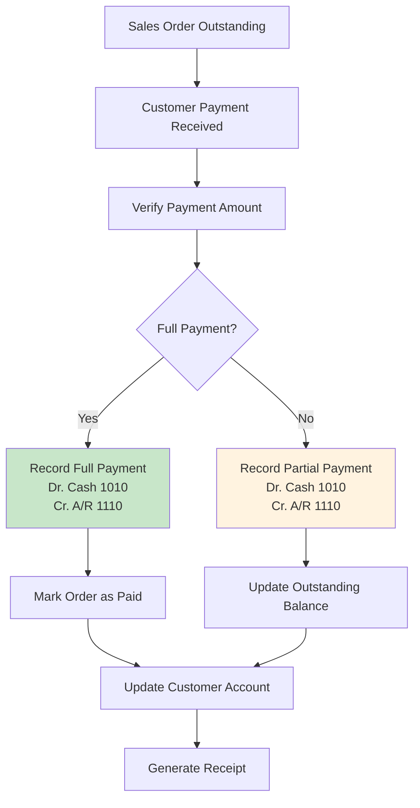

---

## 📊 **Financial Reporting Flow**

### **Report Generation Process**
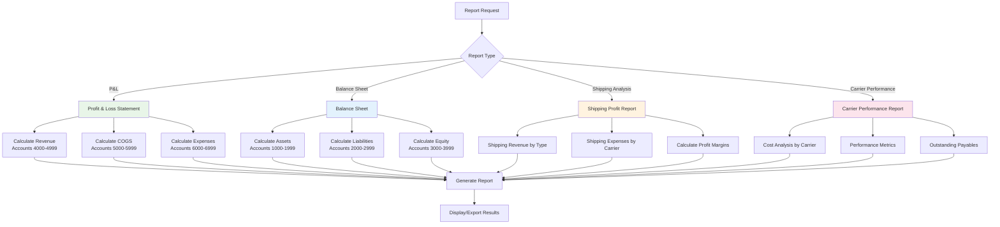

---

## 🔄 **Account Balance Update Flow**

### **Real-time Balance Calculation**
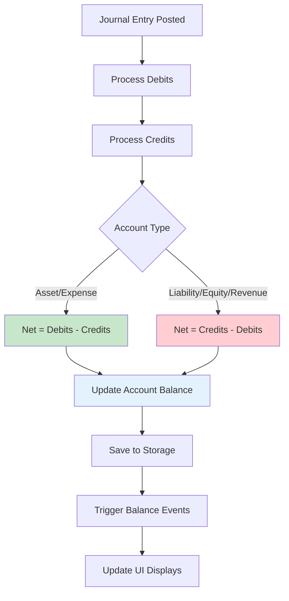

---

## 🧪 **System Integration Points**

### **Module Integration Architecture**
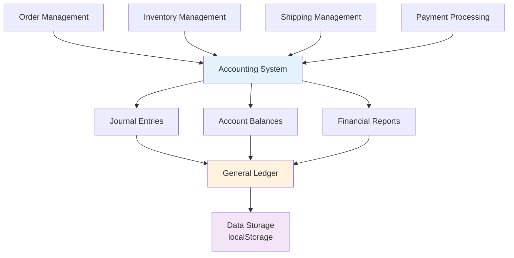

---

These business flow diagrams provide a comprehensive visual guide to understanding how the Order Management System processes business transactions and integrates them with the accounting system. Each flow shows the complete path from business action to financial recording, ensuring transparency and auditability of all operations.

---

## 📋 **Documentation Summary**

This comprehensive documentation package includes:

1. **📊 OMS-Business-Logic-Analysis.md** - Complete business process analysis
2. **📚 OMS-Accounting-System-Documentation.md** - Detailed accounting system architecture
3. **👥 OMS-Accounting-User-Guide.md** - User guide for business users and accountants
4. **🔧 OMS-Accounting-Technical-Documentation.md** - Developer technical reference
5. **📊 OMS-Business-Flow-Diagrams.md** - Visual business process flows

### **Key Integration Points:**
- ✅ **Automated Journal Entries** for all business transactions
- ✅ **Real-time Account Balances** with proper debit/credit handling
- ✅ **Multi-Carrier Shipping Integration** with dedicated expense tracking
- ✅ **FIFO Inventory Costing** for accurate cost of goods sold
- ✅ **Comprehensive Financial Reporting** with P&L and Balance Sheet
- ✅ **Complete Audit Trail** with transaction history and validation

### **Business Benefits:**
- **Financial Transparency** - Real-time visibility into all financial aspects
- **Operational Efficiency** - Automated accounting reduces manual work
- **Compliance Ready** - Double-entry bookkeeping with audit trails
- **Performance Tracking** - Detailed carrier and shipping profitability analysis
- **Scalable Architecture** - Designed to grow with business needs
